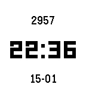

# Type

**Type** is an opinionated, minimalist watchface for Pebble Time and Time Steel.

It is built on a simple premise: A smartwatch should be a watch first. It prioritizes instant legibility, native performance, and hardware empathy over feature bloat.



## Design Philosophy & Features

- **Hardware Empathy:** Designed specifically for the reflective Memory LCD. Black text on a white background offers superior contrast in all lighting conditions.
- **Zero Latency:** Relies exclusively on on-device data (Time & Health API). No web APIs, no loading times, and zero impact on phone battery.
- **Typographic Hierarchy:** A vertically balanced stack using native system fonts (`LECO` and `Gothic`) for crisp, artifact-free rendering.
- **Calm Tech:** The interface remains distraction-free. A discreet **1px red line** appears at the top of the screen _only_ when the battery drops to **20% or lower**.

## Build from source

Ensure you have the Pebble SDK installed.

```bash
# Build the project
pebble build

# Install to watch
pebble install --cloudpebble

```

## License

MIT License. Free to use, modify, and learn from.
