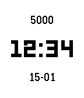

# Type

[](https://opensource.org/licenses/MIT)
[](https://github.com/alexanderteinum/pebble-type/actions/workflows/build.yml)

An opinionated, minimalist watchface for Pebble prioritizing instant legibility and native performance.



## Design Philosophy & Features

- **High Contrast:** Designed specifically for the reflective Memory LCD. Black text on a white background offers superior contrast in all lighting conditions.
- **Zero Latency:** Relies exclusively on on-device data (Time & Health API). No web APIs, no loading times, and zero impact on phone battery.
- **Typographic Hierarchy:** A vertically balanced stack using native system fonts (LECO and Gothic) for crisp, artifact-free rendering.
- **Calm Tech:** The interface remains distraction-free. A red line appears along the edge of the screen when the battery drops to 20% or lower.

## Build from source

Ensure you have the Pebble SDK installed.

```bash
# Build the project
pebble build

# Install to watch
pebble install --cloudpebble
```

## License

MIT License. Free to use, modify, and learn from.
